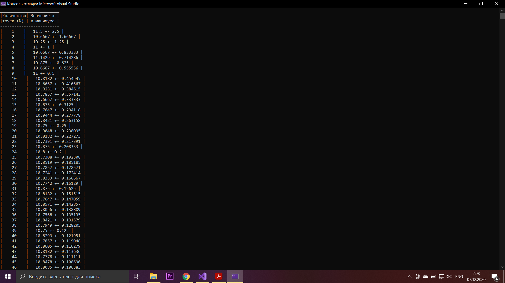
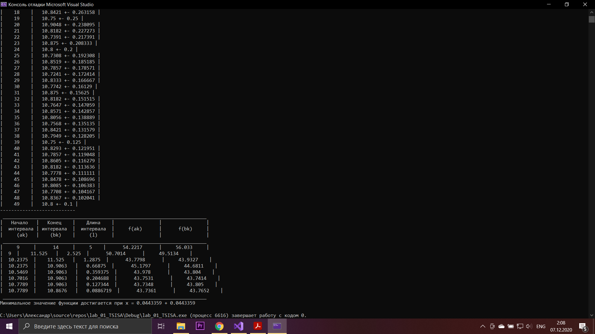

# Лабораторная работа №1 по Теории систем и системному анализу
Вариант 16

## Задание
На интервале [9;14] задана унимодальная функция одного переменного f(x) = x^(2)exp[sin(x)]
Используя метод дихотомии, найти интервал нахождения минимума этой функции
при заданной наибольшей допустимой длине интервала неопределенности Е = 0,1.
Провести сравнение с методом оптимального пассивного поиска. 
Результат, в зависимости от числа точек разбиения N, представить в виде таблицы.

## Выполнение
Код файла, реализующего функции дихотомии и оптимального пассивного поиска,а также представляющего результаты в виде таблицы, приведен в main.cpp

